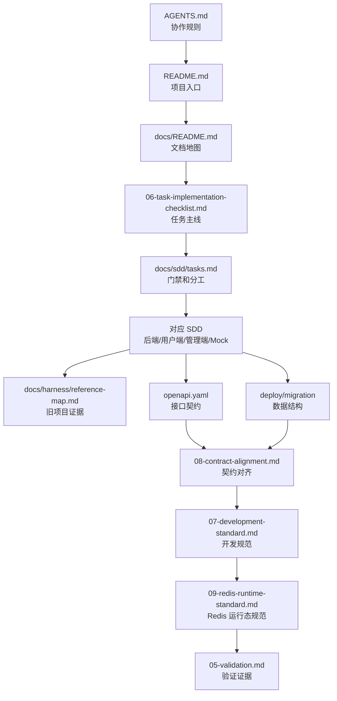

# 文档地图

本文是众享拼项目的文档总入口，用于说明每份文档在开发过程中的职责、阅读顺序和更新规则。后续开始任何编码任务前，先用本文判断应该读取哪些文档，再进入具体任务。

## 1. 文档定位

本项目采用“规划文档 + SDD + Harness + OpenAPI + 验证记录”的方式推进开发：

- 规划文档回答“项目要做什么、按什么阶段做、遵守哪些工程规则”。其中 `docs/plan/06-task-implementation-checklist.md` 是唯一任务事实源。
- SDD 回答“某个后端、前端或 Mock 工作包具体如何构建”。
- Harness 回答“旧项目里哪些行为可以作为只读参考证据”。
- OpenAPI 回答“前后端、Mock，以及 M3 之后落地的后端 DTO 共同遵守什么契约”。
- migration 回答“哪些表、字段、索引、唯一键和状态持久化是交易事实源”。
- 验证文档回答“怎样证明任务真的完成，并且没有破坏高风险边界”。

## 2. 开发阅读流

## 3. 文档职责表

| 文档 | 主要功能 | 开发中什么时候读 | 什么时候更新 |
| --- | --- | --- | --- |
| `AGENTS.md` | Agent 协作入口，约束工作区边界、文档读取顺序、旧项目参照规则、编码和总结要求。 | 每次任务开始前。 | 协作流程、上下文规则或开发纪律变化时。 |
| `README.md` | 仓库首页，说明项目目标、目录结构、技术方向和当前阶段。 | 新成员了解项目、对外展示项目时。 | 项目阶段、目录结构、文档导航或技术方向变化时。 |
| `docs/README.md` | 文档地图，统一说明各文档职责、阅读流和更新规则。 | 不确定该读哪份文档时；交接任务前。 | 新增文档类型、调整文档职责或开发流程时。 |
| `docs/plan/00-overview.md` | 项目概览，说明重构目标、Harness + SDD 方法论、P0 主链路和核心风险。 | 理解项目为什么这样做时。 | 项目定位、P0 范围或核心风险变化时。 |
| `docs/plan/01-architecture.md` | 架构设计，定义后端、前端、部署和文档目录的目标结构与模块边界。 | 初始化工程骨架、调整模块边界时。 | 目录结构、模块职责或依赖方向变化时。 |
| `docs/plan/02-business-design.md` | 业务设计，定义认证、会场、试算、交易、退款、任务治理、缓存、后台治理等核心规则。 | 实现业务规则和状态机前。 | 业务链路、状态流转、风险边界变化时。 |
| `docs/plan/03-git-versioning.md` | Git 与版本管理，定义分支、提交、tag、PR、CI、发布和回滚规则。 | 创建分支、提交、发布、回滚前。 | 分支策略、tag 节点、CI 或发布方式变化时。 |
| `docs/plan/04-roadmap.md` | 开发路线图，按阶段说明从文档基线到 P0 闭环的阶段关系和退出标准，不维护任务清单。 | 判断当前进度、规划下一个阶段时。 | 阶段顺序、里程碑状态或 P0/P1 边界变化时。 |
| `docs/plan/05-validation.md` | 验证计划，定义主链路、分层验证和高风险用例。 | 写测试、联调、任务验收和发布前。 | 新增高风险场景、测试门禁或验收方式变化时。 |
| `docs/plan/06-task-implementation-checklist.md` | 任务实施清单，作为唯一任务事实源，定义任务编号、目标、验收标准、完整推进顺序和建议提交。 | 领取任何具体任务前。 | 新增任务、调整范围、记录实际偏差时。 |
| `docs/plan/07-development-standard.md` | 项目开发规范，定义 Java、注释、编码格式、质量门禁和任务总结要求。 | 后端任务和工程质量相关任务前。 | 规范、注释要求、编码格式或静态扫描策略变化时。 |
| `docs/plan/08-contract-alignment.md` | 契约对齐规范，统一 OpenAPI、Mock、前端类型和 migration 字段映射。 | 任何影响 API、Mock、前端类型或数据库字段的任务前。 | 接口字段、枚举、状态、表结构或 Mock 策略变化时。 |
| `docs/plan/09-redis-runtime-standard.md` | Redis 运行态规范，定义 key、TTL、一致性、Lua、部署安全和验证边界。 | 涉及 session、验证码、缓存、锁单占位、任务锁或 Redis/MySQL 巡检时。 | Redis 用途、key 结构、TTL、Lua 规则、安全边界或验证策略变化时。 |
| `docs/superpowers/plans/*.md` | 阶段性执行计划归档，记录某次收口、修订或实现前的具体步骤、分工、验证方式和停止条件；不作为长期全局事实源。 | 执行复杂任务前；需要按计划交接给 Agent 或人工执行时。 | 执行计划、验证步骤、分工方式或任务状态变化时。 |
| `docs/plan/openapi.yaml` | API 单一事实源，定义路径、请求、响应、错误码、schema 和示例。 | M1 契约任务、前端接口、Mock、M3 后端 DTO 和联调前。 | 任何 API 或字段契约变化时。 |
| `docs/harness/README.md` | Harness 执行指南，说明旧项目只读参照规则和证据记录格式。 | 需要查看旧项目行为证据前。 | Harness 使用规则或证据格式变化时。 |
| `docs/harness/reference-map.md` | Harness 参考索引，列出每类任务应查看的旧项目文件和提取重点。 | 实现任务前查旧项目路径时。 | 旧项目参考范围或任务证据要求变化时。 |
| `docs/sdd/README.md` | SDD 索引，说明各 SDD 范围、规则和 Agent 交接格式。 | 查找某类任务对应 SDD 时。 | SDD 文件结构或交接格式变化时。 |
| `docs/sdd/tasks.md` | SDD 任务门禁与依赖规则，定义任务就绪门禁、Agent 分工、阶段依赖和 PR 检查清单，不维护任务事实源。 | 判断任务是否可以开工时。 | 门禁、分工、阶段依赖或 PR 检查要求变化时。 |
| `docs/sdd/backend/spec.md` | 后端 SDD，定义多模块职责、横切契约、数据库、认证、会场、交易、运行态和后台 API 的后端实现边界。 | 后端任务开始前。 | 后端实现决策、模块边界或验收标准变化时。 |
| `docs/sdd/frontend-user/spec.md` | 用户端 SDD，定义用户端路由、API 客户端、状态、页面要求、Mock 和验证方式。 | 用户端任务开始前。 | 用户端页面、路由、状态或接口字段变化时。 |
| `docs/sdd/frontend-admin/spec.md` | 管理端 SDD，定义后台路由、治理页面、API 客户端、权限、Mock 和验证方式。 | 管理端任务开始前。 | 管理端页面、权限、治理流程或接口字段变化时。 |
| `docs/sdd/mock/strategy.md` | Mock 与并行开发策略，定义 OpenAPI 示例、前端内存 Mock、后端本地 Mock 和种子数据规则。 | 后端未完成但前端需要并行开发时。 | Mock 场景、数据形状或切换策略变化时。 |
| `docs/deploy/server-docker.md` | 云服务器 Docker 环境配置方案，定义 Ubuntu、Docker、Compose、Nginx、MySQL、Redis、目录、端口、安全和验收边界。 | 规划云服务器、部署演练、发布前环境检查时。 | 服务器部署方式、端口、安全策略、数据持久化或发布流程变化时。 |
| `docs/deploy/mysql-connection-troubleshooting.md` | MySQL 连接故障复盘与排查记录，记录旧项目配置证据、新项目修正方式、Java 版本和 JDBC 验证流程。 | 健康检查 `db: DOWN`、JDBC 连接异常、云端 MySQL 联调或本地 Java 版本异常时。 | 数据库连接参数、JDK 版本策略、云端 MySQL 暴露方式或健康检查验证方式变化时。 |
| `deploy/migration/V1__init_schema.sql` | P0 初始表结构和数据事实源，定义用户、商品、活动、交易、可靠事件、标签、DCC 和审计表。 | M2 数据库任务、M3 后端持久化、Mapper 和数据验证前。 | 未合并前可修订；合并后只新增下一版 migration。 |

## 4. 任务启动检查

开始一个具体任务前，按下面顺序收敛范围：

1. 从 `docs/plan/06-task-implementation-checklist.md` 确认任务编号和验收标准。
2. 从 `docs/sdd/tasks.md` 确认任务就绪门禁、依赖顺序和 Agent 分工。
3. 读取对应 SDD：后端、用户端、管理端或 Mock。
4. 从 `docs/harness/reference-map.md` 查旧项目参考文件，只提取行为和约束。
5. 如果影响接口，先更新或确认 `docs/plan/openapi.yaml`。
6. 如果影响数据，先更新或确认 migration 和 `docs/plan/08-contract-alignment.md`。
7. 如果是后端任务，确认 `docs/plan/07-development-standard.md` 的注释、编码和质量门禁。
8. 如果涉及 Redis session、缓存、Lua、任务锁或运行态巡检，确认 `docs/plan/09-redis-runtime-standard.md`。
9. 明确验证方式，至少对应 `docs/plan/05-validation.md` 中的一项证据。

## 5. 文档更新规则

- 任务范围变化：先更新任务清单，再按需更新对应 SDD 的实现边界。
- API 字段变化：先更新 OpenAPI，再同步 SDD、Mock、前端类型和契约对齐规范。
- 数据字段变化：更新 migration 或新增下一版 migration，并同步契约对齐规范。
- 业务规则变化：更新业务设计、对应 SDD 和任务验收标准。
- Redis 运行态变化：更新 Redis 运行态规范，并按影响范围同步业务设计、后端 SDD、部署文档和验证计划。
- 架构边界变化：更新架构设计；如属于关键取舍，后续补充 ADR。
- 验证方式变化：更新验证计划和任务门禁。
- 发布流程变化：更新 Git 与版本管理文档，以及后续 release note。

## 6. 当前阶段判断

当前仓库已完成 M1 契约与模型收口，以及 M2 数据库与 migration 收口。OpenAPI 覆盖 P0 用户端、管理端和运行态治理端点；统一响应为 `code/message/data/traceId`，分页为 `pageNo/pageSize/total/items`；状态枚举和错误码已定义，并与 `docs/plan/08-contract-alignment.md` 的契约映射保持一致。

M2 当前状态记录为“已验证并可作为 M3 输入”。`deploy/migration/V1__init_schema.sql` 已纳入 Git，云服务器 Docker MySQL 8.4 已完成临时空库导入、关键索引检查、种子数据计数和唯一键/非空约束负向验证；临时验证库已删除。`docs/superpowers/plans/2026-05-30-m2-migration-closeout.md` 已更新为执行归档。

下一步主线是 M3 后端骨架。阶段边界以 `docs/plan/04-roadmap.md` 为准：M1 不创建后端 Java 模块，M2 不创建 Mapper、Repository 或领域代码，M3 才开始后端工程落地。OpenAPI 是 API 契约事实源，migration 是数据和交易事实源。
