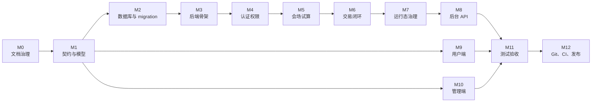

# 开发路线图

本文用于说明众享拼从文档基线到 P0 完整闭环的阶段推进顺序。具体任务粒度以 `docs/plan/06-task-implementation-checklist.md` 为准，本文只负责阶段视角、依赖关系和退出标准。

## 1. 当前阶段

当前项目处于“文档基线统一”阶段：

- 已有项目入口、规划文档、SDD、Harness 参考索引、OpenAPI 契约和 V1 migration 初稿。
- 后端和前端目录还没有可运行工程。
- 自动化验证、CI、发布说明和回滚说明尚未建立。

当前阶段完成后，应先形成一次文档基线提交，再按 M1 契约验证、M2 数据库与 migration 验证、M3 后端骨架初始化推进。

## 2. 阶段边界

M1 和 M2 是编码前的设计冻结阶段，只产出可验证的契约、Mock 示例、字段映射和 migration，不创建 Java 后端模块，不编写 Controller、Service、Mapper、Repository 或业务实现代码。M3 才开始落地后端 Maven 多模块和最小可启动工程；M4 之后再按业务域实现认证、会场、交易、运行态和后台 API。

事实源边界如下：

- OpenAPI 是 API 路径、请求、响应、错误码、示例和跨端 schema 的单一事实源。
- migration 是表、字段、索引、唯一键、状态持久化和交易事实的单一事实源。
- MySQL 是交易事实源；Redis 只保存缓存、占位和运行态，不作为最终交易事实。

## 3. 阶段关系

## 4. 里程碑说明

| 里程碑 | 目标 | 当前状态 | 退出标准 |
| --- | --- | --- | --- |
| M0 文档治理 | 统一 README、AGENT、文档地图、任务清单、SDD、Harness 和开发规范。 | 进行中 | 新成员能按文档地图理解项目并领取任务。 |
| M1 契约与模型 | 固定 P0 OpenAPI、错误码、状态枚举、Mock 示例和字段映射，不落地后端 Java 代码。 | 已有初稿 | OpenAPI 可 lint，P0 端点、成功示例和关键失败示例齐全。 |
| M2 数据库与 migration | 建立 V1 migration，固定用户、商品、活动、交易、可靠事件、标签和审计等 P0 表结构，不落地 Mapper 或 Repository。 | 初稿已存在，待纳入 Git 和验证 | migration 可在空库执行，字段与 OpenAPI 关键枚举保持一致。 |
| M3 后端骨架 | 建立后端 Maven 多模块、统一响应、异常处理、基础配置和健康检查。 | 未开始 | 后端可本地启动，空骨架 `mvn test` 通过。 |
| M4 认证权限 | 完成注册、登录、验证码、登录态、管理员权限和审计上下文。 | 未开始 | 认证 API 可用，用户端和管理端权限边界清晰。 |
| M5 会场试算 | 完成活动列表、商品详情、活动试算、折扣、标签命中和缓存策略。 | 未开始 | 用户端可基于 API 展示会场并完成试算。 |
| M6 交易闭环 | 完成开团、参团、锁单、支付、退款、订单列表和详情。 | 未开始 | 主链路可从登录跑到退款，幂等和并发边界有验证。 |
| M7 运行态治理 | 完成超时关单、队伍过期、自动退款、可靠事件和 Redis/MySQL 巡检。 | 未开始 | 异步副作用可落库、重试、查询和手动治理。 |
| M8 后台 API | 完成活动、标签、订单、任务、DCC、线程池和审计治理 API。 | 未开始 | 管理端所需后台治理能力具备类型化接口。 |
| M9 用户端 | 完成用户端登录、会场、详情、结算、支付结果、订单和退款页面。 | 未开始 | 用户端构建通过，Mock 和真实 HTTP 切换路径清楚。 |
| M10 管理端 | 完成后台仪表盘、活动、标签、订单、任务、DCC、线程池和审计页面。 | 未开始 | 管理端构建通过，核心治理流程可演示。 |
| M11 测试验收 | 完成测试矩阵、端到端验收和高风险场景记录。 | 未开始 | 后端测试、前端构建、OpenAPI lint 和主链路验收均有证据。 |
| M12 Git、CI、发布 | 完成 CI、tag、发布说明和回滚说明。 | 未开始 | main 分支有质量门禁，发布和回滚可复盘。 |

## 5. 推荐推进顺序

1. 完成 M0 文档统一，补齐文档地图、路线图和目录职责。
2. 验证 M1 契约初稿，确保 OpenAPI、Mock、状态枚举和字段映射可以对齐。
3. 完成 M2 数据库与 migration 验证，先固定 P0 事实源。
4. 开始 M3 后端骨架，让后端具备可启动、可测试的最小工程。
5. 并行初始化用户端和管理端壳层，但只能基于 OpenAPI 和 Mock 工作，不绕过契约。
6. 按认证、会场、交易、运行态、后台 API 的顺序推进后端能力。
7. 最后补齐测试矩阵、CI、端到端验收、tag、发布和回滚证据。

## 6. P0 完成定义

P0 不是只把页面跑起来，而是同时满足：

- 后端可以本地启动，核心测试通过。
- 用户端可以完成登录、会场、试算、锁单、Mock 支付、订单和退款。
- 管理端可以完成活动、标签、订单、任务、DCC、线程池、审计和仪表盘治理。
- 高风险场景有自动化测试或明确的手工验收记录。
- OpenAPI、Mock、前端类型、M3 后端 DTO 和 migration 字段保持一致。
- 具备可回溯的 tag、发布说明和回滚说明。

## 7. P1 边界

P1 只承接 P0 之后的增强项，例如 OpenAPI 自动生成前端类型、Testcontainers、ArchUnit、缓存指标、灰度开关、降级策略和更完整的生产化可观测性。P1 不能用来承接 P0 基础功能缺口。
