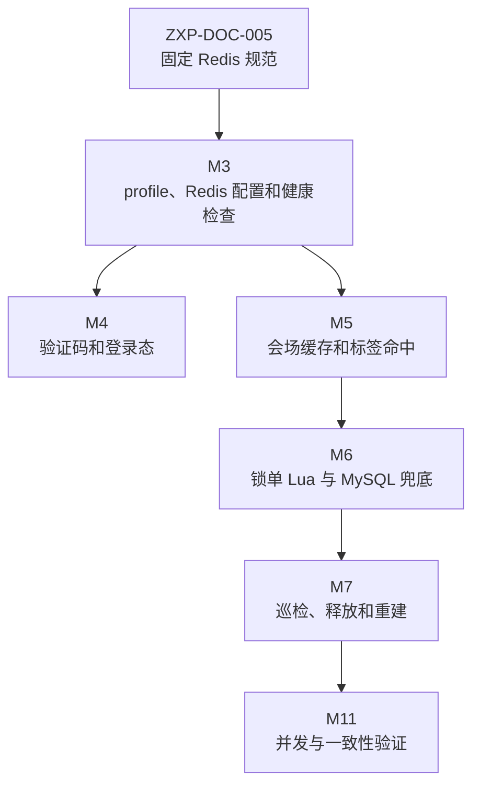

# Redis 运行态规范

本文用于固定众享拼 P0 阶段 Redis 的职责边界、key 设计、TTL、一致性、Lua 使用、安全和验证规则。本文只定义规范，不创建后端 Java 模块、Redis 配置类、Lua 脚本或真实运行配置。

## 1. 规范定位

Redis 在本项目中承担高频读优化和运行态辅助，不承担交易事实源职责。所有涉及订单、支付、退款、队伍最终状态、可靠事件、标签批次和审计的数据，必须能从 MySQL 表结构中恢复。

| 范围 | Redis 职责 | MySQL 职责 |
| --- | --- | --- |
| 认证 | 验证码、登录态、session TTL | 用户账号、角色、状态、密码 hash |
| 会场 | 活动列表缓存、商品详情缓存、试算辅助缓存、缓存互斥重建 | 商品、活动、折扣、活动版本、SKU 绑定 |
| 标签 | 在线命中加速、短期结果缓存 | 标签定义、任务批次、用户明细、current batch |
| 交易 | 锁单前置占位、队伍运行态快照、释放辅助 | 队伍、订单、支付、退款、唯一键和条件更新 |
| 任务 | 轻量执行锁、短期去重辅助 | 可靠事件状态、重试次数、下次执行时间、失败原因 |
| 治理 | 指标临时聚合、缓存开关辅助 | DCC 配置、审计日志、后台操作记录 |

核心原则：

- Redis 成功不代表交易成功，必须由 MySQL 条件更新、唯一键和事务最终确认。
- Redis 失败不能导致已提交的 MySQL 事实丢失；不可丢副作用必须落 `reliable_event`。
- Redis 数据丢失、过期或脏读时，运行态以 MySQL 快照重建。
- Redis key、TTL 和 Lua 入参必须能从任务编号、业务对象和环境前缀追溯。

## 2. 阶段边界



阶段约束：

- M1 只固定 OpenAPI、错误码、状态枚举、Mock 示例和字段映射，不创建 Redis 实现。
- M2 只固定 migration、唯一键、索引和 MySQL 交易事实源，不创建 Redis key 或 Lua 脚本。
- M3 才创建后端 Redis 连接、profile 配置、健康检查和基础 key 前缀配置。
- M4 到 M7 按认证、会场、交易和运行态任务逐步落地 Redis 用法。

## 3. Key 命名规则

Redis key 使用统一前缀：

```text
zxp:{env}:{domain}:{name}:{id...}
```

字段含义：

| 片段 | 含义 | 示例 |
| --- | --- | --- |
| `zxp` | 项目标识，避免和同机其他项目冲突 | `zxp` |
| `{env}` | 环境标识，由 profile 或配置注入 | `local`、`dev`、`test`、`prod` |
| `{domain}` | 业务域 | `auth`、`market`、`tag`、`trade`、`runtime`、`lock` |
| `{name}` | key 语义 | `code`、`session`、`activity`、`team`、`slot`、`mutex` |
| `{id...}` | 稳定业务标识，不放敏感明文 | `userId`、`activityId`、`teamId`、`orderId` |

命名约束：

- 不把手机号、验证码、token、密码、身份证或完整请求 payload 直接放进 key。
- 需要包含用户身份时优先使用后端 `userAccountId`，手机号需 hash 后再进入 key。
- key 中的枚举值必须与 OpenAPI、migration 和后端枚举一致。
- 同一业务域不得出现多套等价 key 命名，例如 `session:user` 和 `user:session` 混用。

建议 key：

| 用途 | Key 模板 | 说明 |
| --- | --- | --- |
| 验证码 | `zxp:{env}:auth:code:{purpose}:{phoneHash}` | `purpose` 使用 `REGISTER/LOGIN/BIND_PHONE` |
| 登录态 | `zxp:{env}:auth:session:{tokenHash}` | value 保存最小用户上下文，不保存密码和验证码 |
| 会场列表 | `zxp:{env}:market:activity:list:{source}:{channel}:{pageNo}:{pageSize}:v{version}` | 版本来自活动或缓存版本事实 |
| 活动详情 | `zxp:{env}:market:activity:{activityId}:v{version}` | 活动变更后版本失效 |
| 空值缓存 | `zxp:{env}:market:null:{resource}:{id}` | 防穿透，TTL 必须短 |
| 缓存互斥 | `zxp:{env}:lock:cache-rebuild:{resource}:{id}` | 防止热点 key 同时重建 |
| 标签命中 | `zxp:{env}:tag:hit:{tagId}:{batchId}:{userAccountId}` | 缺失时回查 MySQL 明细 |
| 队伍运行态 | `zxp:{env}:trade:team:{teamId}:runtime` | 保存 cursor、slot、release 等运行态摘要 |
| 锁单占位 | `zxp:{env}:trade:team:{teamId}:slot:{occupyNo}` | 前置占位，不替代订单事实 |
| 任务执行锁 | `zxp:{env}:lock:event:{eventType}:{bizKey}` | 防并发重复执行，最终状态仍看 `reliable_event` |
| 巡检标记 | `zxp:{env}:runtime:inspect:{teamId}` | 短期去重或节流，不作为修复事实 |

## 4. TTL 规则

所有 Redis key 必须有明确 TTL 或明确说明为什么可以常驻。不得创建无 TTL 的临时缓存、验证码、session、锁或占位 key。

| 用途 | 建议 TTL | 规则 |
| --- | --- | --- |
| 注册验证码 | 5 分钟 | 过期后必须重新发送；错误次数限制可使用独立短 TTL key |
| 登录验证码 | 5 分钟 | 与注册验证码按 `purpose` 隔离，不能混用 |
| 登录态 session | 2 小时，可滑动续期 | 续期只发生在有效请求；登出必须删除 |
| 会场列表缓存 | 30 秒到 2 分钟 | 高变更活动用更短 TTL，后台变更触发版本失效 |
| 活动详情缓存 | 1 到 5 分钟 | 必须包含活动版本或精确失效能力 |
| 空值缓存 | 30 到 60 秒 | 只防穿透，不能长期掩盖真实新数据 |
| 缓存互斥锁 | 3 到 10 秒 | 必须设置随机 token，释放时校验持有者 |
| 标签命中缓存 | 5 到 30 分钟 | key 必须包含 `batchId`，切换批次自然失效 |
| 锁单占位 | 订单待支付截止时间加缓冲 | MySQL 落库失败必须释放或写释放事件 |
| 任务执行锁 | 单次任务最大执行时间加缓冲 | 任务最终状态以 `reliable_event` 为准 |
| 巡检去重标记 | 30 到 120 秒 | 只用于节流，不能阻止必要修复 |

TTL 设计规则：

- TTL 不得长于业务对象的有效期，例如队伍占位不能超过队伍有效期和订单支付截止时间。
- 写入 value 时同步写 TTL，禁止先 `set` 后单独 `expire` 造成异常窗口。
- 对热点缓存允许增加小幅随机抖动，避免同一时间集中失效。
- 后台变更活动、折扣、SKU 绑定或标签批次后，必须通过版本或精确 key 失效影响用户端读模型。

## 5. 一致性策略

| 场景 | 处理规则 | 后续任务 |
| --- | --- | --- |
| Redis 不可用，读取会场缓存失败 | 回查 MySQL；记录降级日志；可短期关闭缓存 | `ZXP-BE-MARKET-005` |
| Redis 不可用，验证码或 session 读写失败 | 认证能力返回系统繁忙或明确错误，不静默放行 | `ZXP-BE-AUTH-002`、`ZXP-BE-AUTH-003` |
| Redis 占位成功，MySQL 条件更新失败 | 释放 Redis slot；释放失败写 `REDIS_SLOT_RELEASE` 事件 | `ZXP-BE-TRADE-002`、`ZXP-BE-RUNTIME-004` |
| MySQL 提交成功，Redis 释放失败 | 不回滚 MySQL；写可靠事件异步释放 | `ZXP-BE-TRADE-004`、`ZXP-BE-RUNTIME-004` |
| Redis 队伍运行态丢失 | 从 MySQL 的 WAIT_PAY、PAID 和队伍状态重建 | `ZXP-BE-RUNTIME-003` |
| Redis 队伍运行态与 MySQL 不一致 | 巡检只挂 `TEAM_REBUILD` 事件，重建时以 MySQL 快照覆盖 Redis | `ZXP-BE-RUNTIME-003` |
| 任务执行锁过期但任务仍运行 | handler 必须幂等；状态推进用 MySQL 条件更新保护 | `ZXP-BE-RUNTIME-004` |

一致性规则：

- 涉及金额、名额和状态的操作，必须在 MySQL 事务中完成最终确认。
- Redis 操作不能跨越 Application 的业务边界直接决定订单状态。
- 不可丢的 Redis 清理、通知和重建动作必须写入可靠事件。
- 巡检发现不一致时不直接在扫描逻辑里做复杂修复，优先写可靠事件，由幂等 handler 执行。

## 6. Lua 使用规则

Lua 只用于 Redis 内部原子操作，不能承载跨 MySQL 的最终业务决策。

允许使用 Lua 的场景：

- 队伍 slot 原子占位。
- 校验并释放由当前请求持有的缓存互斥锁。
- 原子更新队伍运行态摘要中的 cursor 或 slot 集合。

禁止使用 Lua 的场景：

- 直接判定订单支付成功、退款成功或队伍最终成团。
- 替代 MySQL 唯一键和条件更新。
- 写入无法从 MySQL 恢复的唯一业务事实。
- 在脚本里硬编码活动、折扣、金额或用户权限规则。

Lua 脚本落地要求：

- 脚本文件从 M6 交易任务开始放入 `infrastructure/redis/lua`。
- 每个脚本必须有中文注释说明 key、argv、返回码、幂等行为和失败释放策略。
- Java 调用侧必须把返回码转换为项目错误码或稳定业务结果。
- 脚本变更必须配套并发测试或手工压测记录。

## 7. 序列化与数据结构

Redis value 只保存运行所需的最小数据：

- session 保存 `userAccountId`、`role`、`status`、`loginTime`、`expireAt` 等最小上下文。
- 会场缓存保存 OpenAPI 所需读模型，不保存后端内部异常、SQL 或敏感字段。
- 队伍运行态保存 slot、cursor、lockCount 摘要，不保存完整订单快照。
- 标签命中缓存保存命中布尔值、`tagId`、`batchId` 和短期统计摘要。

序列化规则：

- 结构化 value 使用 JSON，字段名与 OpenAPI 或后端 DTO 保持一致。
- 不使用 JDK 原生序列化，避免跨版本不可读和安全风险。
- value 中需要版本字段时使用 `schemaVersion` 或业务版本字段，不依赖 Java 类名。
- 日志不得输出完整 Redis value；必要时只输出 key 摘要、业务 id 和 traceId。

## 8. 安全与部署

部署侧约束以 `docs/deploy/server-docker.md` 为准，Redis 规范补充如下：

- Redis 必须设置强密码，不允许匿名访问。
- `.env`、服务器私有配置和 Redis 密码不得提交 Git。
- 开发期如临时开放 `6379` 公网端口，必须使用强密码并限制暴露周期。
- 生产发布前必须关闭 Redis 公网访问，优先使用 Compose 内网或 SSH tunnel。
- 应用日志、错误响应和审计记录不得暴露 Redis 密码、session、验证码、token、完整 key 或内部脚本路径。
- `/api/v1/health` 可以返回 `redis: UP/DOWN`，不得返回连接串、密码、key 数量或敏感配置。

## 9. 任务映射

| 阶段 | 任务 | Redis 相关落点 |
| --- | --- | --- |
| M3 | `ZXP-BE-SKEL-003` | profile、Redis 连接、健康检查、key 前缀配置 |
| M4 | `ZXP-BE-AUTH-002` | 验证码 key、用途隔离、TTL 和错误次数限制 |
| M4 | `ZXP-BE-AUTH-003` | session 存储、续期、登出清理和 UserContext |
| M5 | `ZXP-BE-MARKET-004` | 标签命中缓存、Redis 缺失回退 MySQL 明细 |
| M5 | `ZXP-BE-MARKET-005` | 会场 Cache Aside、版本失效、空值缓存、互斥重建 |
| M6 | `ZXP-BE-TRADE-002` | Redis Lua 占位、MySQL 条件更新兜底、失败释放 |
| M6 | `ZXP-BE-TRADE-004` | 支付后清理 slot，失败写可靠事件 |
| M7 | `ZXP-BE-RUNTIME-003` | Redis/MySQL 巡检和队伍运行态重建 |
| M7 | `ZXP-BE-RUNTIME-004` | 可靠事件执行锁、Redis 释放、重建 handler |
| M11 | `ZXP-QA-002` | 并发锁单、Redis 成功 MySQL 失败、Redis 丢失重建测试 |

## 10. 验证清单

文档阶段：

- `ZXP-DOC-005` 不创建后端 Java 模块、Redis 配置类、Lua 脚本或真实 Compose 文件。
- README、文档地图、任务清单和业务设计均能指向本文。
- 本文未写入密码、服务器私有配置或可直接复用的敏感连接串。
- Redis 用途均能映射到 P0 现有任务编号。

实现阶段：

- `ZXP-BE-SKEL-003` 验证 `/api/v1/health` 返回 app、db、redis 状态。
- `ZXP-BE-AUTH-002` 验证验证码过期、用途不匹配和错误码。
- `ZXP-BE-AUTH-003` 验证 session 过期、登出删除和 ThreadLocal 清理。
- `ZXP-BE-MARKET-005` 验证缓存命中、版本失效、空值缓存和互斥重建。
- `ZXP-BE-TRADE-002` 验证并发锁单不超卖、重复 `clientOrderNo` 幂等、Redis 成功 MySQL 失败可释放。
- `ZXP-BE-RUNTIME-003` 验证删除 Redis 队伍 key 后可以从 MySQL 重建。
- `ZXP-QA-002` 汇总并发和一致性证据，证明 Redis 故障不会破坏 MySQL 事实源。

## 11. Harness 证据要求

后续实现 Redis 相关任务时，按 `docs/harness/reference-map.md` 只读旧项目并记录证据：

| 领域 | 参考重点 | 新项目决策 |
| --- | --- | --- |
| 认证 | Redis session、验证码用途、登录态过期 | 保留登录态行为，强化用途隔离和敏感信息脱敏 |
| 会场 | 活动缓存、标签命中、缓存回填字段 | 保留 Cache Aside 思路，补版本失效和空值缓存边界 |
| 交易 | Redis Lua 占位、锁单幂等、失败释放 | 保留前置占位，明确 MySQL 条件更新才是最终兜底 |
| 运行态 | 超时释放、队伍修复、补偿任务 | 统一落到可靠事件和巡检重建，不依赖 Redis 永久可靠 |

每次实现总结必须说明旧文件、提取行为、隐性约束、新实现决策和偏差；涉及交易、支付、退款路径且 Redis 相关验证无法通过时，必须停止并请求人工复核。
